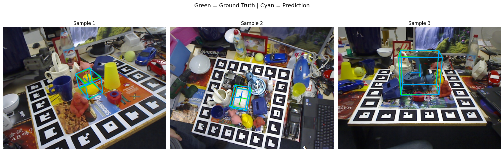
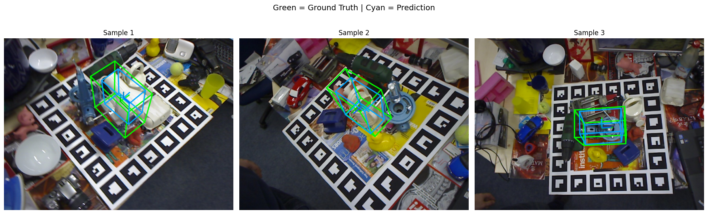

# 6D Object Pose Estimation using RGB-D Data: TridentNet

This repository contains the implementation of **TridentNet**, a deep learning architecture designed for robust 6D Object Pose Estimation (3D Translation and 3D Rotation) from RGB-D data.

The project investigates the limitations of purely geometric approaches and proposes a multi-modal fusion network that combines semantic features (RGB) and geometric features (Depth) to achieve state-of-the-art performance on the LINEMOD benchmark.

## Project Overview

The goal of 6D Pose Estimation is to determine the precise 3D position ($x, y, z$) and 3D orientation (quaternion or rotation matrix) of an object relative to the camera.

This project implements a **two-stage pipeline**:
1.  **2D Detection:** A YOLO11n detector locates the object in the image and provides a 2D Bounding Box.
2.  **6D Pose Estimation:** The object is cropped from both RGB and Depth images. These crops are fed into **TridentNet**, which regresses the final pose parameters.

## Architecture: TridentNet

TridentNet is designed to solve the "Weak Perspective" ambiguity that affects monocular approaches. Instead of approximating depth from the size of the 2D bounding box, it explicitly learns geometric residuals.

### Core Components
1.  **Dual-Stream Encoder:**
    * **RGB Branch:** A ResNet-50 backbone (pretrained) extracts semantic texture and shape features.
    * **Depth Branch:** A custom CNN encoder processes the depth map to extract geometric surface features, using strided convolutions to preserve object boundaries.

2.  **Fusion Module:**
    * Features from RGB, Depth, and the Bounding Box dimensions are concatenated and projected into a shared latent embedding via a Fusion MLP.

3.  **The "Trident" Heads:**
    The network splits into three specialized regression heads:
    * **Rotation Head:** Predicts the object orientation as a unit quaternion ($w, x, y, z$).
    * **Z-Offset Head ($\delta z$):** Predicts a residual correction to adjust the sensor depth (surface) to the object's volumetric center.
    * **Center-Offset Head ($\delta u, \delta v$):** Predicts the misalignment between the 2D bounding box center and the projected 3D centroid.

### Pinhole Back-Projection
Unlike direct translation regression, TridentNet recovers the 3D Translation $T_{xyz}$ analytically using the predicted depth and offsets combined with the camera intrinsic matrix. This ensures geometric consistency between the 2D detections and 3D space.



## Comparison with Geometric Baseline

To validate the approach, we implemented a **Geometric Baseline** for comparison:
* **Method:** Uses ResNet-50 for rotation but calculates translation purely mathematically, assuming the object is a sphere and estimating depth based on the 2D bounding box size (Weak Perspective Approximation).
* **Result:** This method fails on irregular objects (e.g., Driller, Ape), proving that 2D dimensions are not linearly correlated with depth due to perspective distortions.



## Dataset Structure

The project relies on the **LINEMOD** dataset (preprocessed). The data must be organized as follows:

```text
datasets/
└── linemod/
    ├── DenseFusion/                  <-- From Original Dataset
    │   └── Linemod_preprocessed/     
    │       ├── data/                 <-- Object folders (01, 02, ...)
    │       │   ├── 01/
    │       │   │   ├── rgb/          <-- RGB Images
    │       │   │   ├── depth/        <-- Depth Maps
    │       │   │   ├── mask/         <-- Binary Masks
    │       │   │   ├── gt.yml        <-- Ground Truth (Pose)
    │       │   │   └── info.yml      <-- Camera Intrinsics
    │       │   ├── ... 
    │       ├── models/               <-- 3D Meshes (.ply)
    │       └── ..._gt.yml            <-- Preprocessed GT files
    │
    └── YOLO/                         <-- Generated for Detection Stage
        └── datasets/
            ├── data.yaml             
            ├── train/
            ├── val/
            └── test/

```

## Experimental Results

The models were evaluated using the **ADD(S)** metric with a threshold of 10% of the object diameter.

| Model | Input Data | Mean Accuracy | Notes |
| --- | --- | --- | --- |
| **Geometric Baseline** | RGB-Only | **9.3%** | Fails on non-spherical objects due to weak perspective assumption. |
| **DenseFusion (Iterative)** | RGB-D | 94.3% | Reference state-of-the-art literature model. |
| **TridentNet (Ours)** | RGB-D | **96.6%** | Outperforms DenseFusion on 9/13 classes. |

### Key Findings

* **Symmetric Objects:** The use of ADD-S loss allowed the model to reach **100% accuracy** on challenging symmetric objects like *Eggbox* and *Glue*.
* **Small Objects:** Smaller objects (e.g., *Ape*, *Duck*) show slightly lower performance. This is due to the absolute nature of the ADD loss: small objects generate smaller spatial gradients during training, leading the network to focus optimization on larger objects (*Driller*, *Can*).

## Installation and Requirements

The code requires Python and the following libraries:

* PyTorch
* Torchvision
* Ultralytics (for YOLO)
* Pandas (for metrics logging)
* Trimesh (for loading 3D models)
* OpenCV

## Usage

1. **Data Preparation:** Ensure the `datasets/` folder is structured as shown above.
2. **YOLO Training:** Train the object detector to generate 2D bounding boxes.
3. **TridentNet Training:** Run the training script. The training uses a multi-task loss (Rotation + Translation + Projection) and applies online augmentation (Synchronized ROI Jittering).
4. **Evaluation:** Run the evaluation pipeline to compute ADD/ADD-S metrics on the test set.


### Checkpoints
Trained weights for evaluation avalable [here](https://drive.google.com/drive/folders/1oRhXsvlVgGiqvLWzTXqMOFf1CyeH-19k?usp=drive_link).